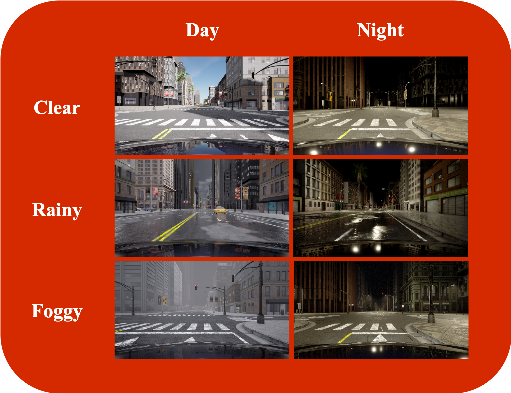
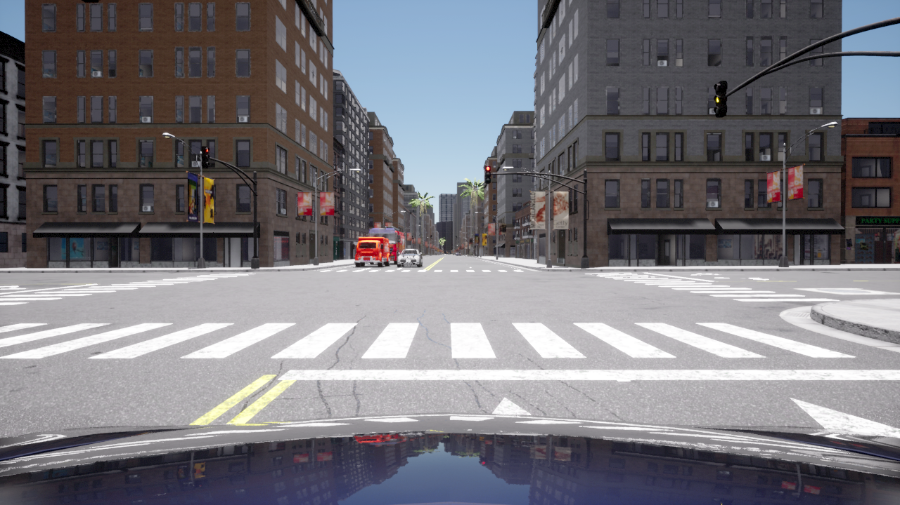
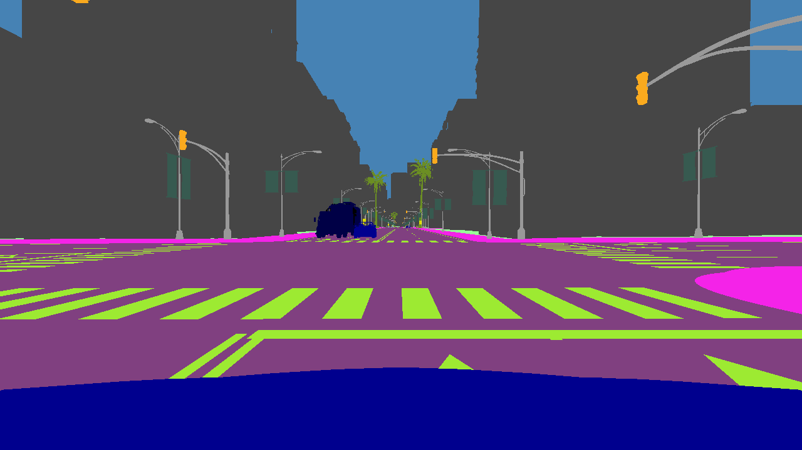
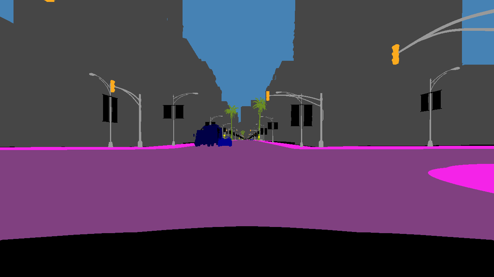

# DADE dataset 

## Overview

The DADE dataset, short for **Driving Agents in Dynamic Environments**, is a synthetic dataset designed for the training and evaluation of methods for the task of semantic segmentation in the context of autonomous driving agents navigating dynamic environments and weather conditions. 

This dataset was generated using the CARLA simulator (version 0.9.14) to provide perfect sensor synchronization and calibration, as well as precise semantic segmentation ground truths. All data were collected within the Town12 map in CARLA. 

DADE dataset is divided into two sub-datasets. For both subsets, each sequence is acquired by one agent (one ego vehicle) running for some time within a 5-hour time frame, amounting to a total of 990k frames for the entire dataset. The agents travel various locations such as forest, countryside, rural farmland, highway, low density residential, community buildings, and high density residential.

<div align="center">
<div></div>
 
</div>

### Subset 1: Static Weather Conditions (Clear Day)

- Number of Video Sequences: 100
- Sequence Length: Varies from 271 to 7200 frames
- Average Sequence Length: 45 minutes
- Total Number of Frames: 270,527
- Total Duration: Over 75 hours of video
- Weather Conditions: Clear sunny weather during the day

### Subset 2: Dynamic Weather Conditions

- Number of Video Sequences: 300
- Sequence Length: Varies from 188 to 7200 frames
- Average Sequence Length: 40 minutes
- Total Number of Frames: 719,742
- Total Duration: 200 hours of video
- Weather Conditions: Dynamically changing weather conditions, transitioning every 10 minutes between clear, rainy, and foggy conditions, with smooth transitions of 10 seconds. The 5-hour period includes approximately 2 hours of night conditions and 3 hours of day conditions.

<div align="center">
<div></div>
 
</div>

### Dataset Contents

The DADE dataset is composed of temporal frames (video sequences) and includes the following information:
- RGB images
- Semantic segmentation ground truths
- GNSS (Global Navigation Satellite System) position data
- Weather information

<div align="center">
<div></div>
  
| **RGB** | **Semantic segmentation ground truths from CARLA** | **Semantic segmentation ground truths used in MSC-TTA** | 
|:----------------:                  |:----------------:                      |:----------------:                |
|   |  |  |

</div>

### Data Details

- Frame Rate: 1 frame per second (1 fps)
- Image Resolution: 720p (1280x720 pixels, high definition, HD)

## Data structure

<pre>
DADE/
├── static_weather
│   ├── <i>sequence</i>/ (name of folder: date of the acquisition, e.g. "2023-07-11_17-35-48")
│   │   ├── semantic_masks/
│   │   │   ├── 001/ (1000 frames per folder)
│   │   │   │   ├── 000001.png
│   │   │   │   ├── 000002.png
│   │   │   │   └── ...
│   │   │   ├── 002
│   │   │   │   ├── 001000.png
│   │   │   │   ├── 001001.png
│   │   │   │   └── ...
│   │   │   └── ...
│   │   ├── semantic_masks_npz/
│   │   │   ├── 001/
│   │   │   │   ├── 000001.npz
│   │   │   │   ├── 000002.npz
│   │   │   │   └── ...
│   │   │   ├── 002
│   │   │   │   ├── 001000.npz
│   │   │   │   ├── 001001.npz
│   │   │   │   └── ...
│   │   │   └── ...
│   │   ├── semantic_masks_carla/
│   │   │   ├── 001/
│   │   │   │   ├── 000001.png
│   │   │   │   ├── 000002.png
│   │   │   │   └── ...
│   │   │   ├── 002
│   │   │   │   ├── 001000.png
│   │   │   │   ├── 001001.png
│   │   │   │   └── ...
│   │   │   └── ...
│   │   ├── <i>sequence</i>.mp4
│   │   ├── <i>sequence</i>.json
│   │   └── gnss.json
│   └── ...
├── dynamic_weather
│   ├── <i>sequence</i>/
│   │   ├── semantic_masks/
│   │   ├── semantic_masks_npz/
│   │   ├── semantic_masks_carla/
│   │   ├── <i>sequence</i>.mp4
│   │   ├── <i>sequence</i>.json
│   │   ├── gnss.json
│   │   └── weather.json
├── Town12.png
└── ReadMe.md
</pre>

The `semantic_masks_carla` folder contains the semantic segmentation ground truths as directly collected with the CARLA simulator. For a definiton of class labels, see the [CARLA documentation](https://carla.readthedocs.io/en/0.9.14/ref_sensors/#semantic-segmentation-camera).

The `semantic_masks` and `semantic_masks_npz` folders contains the same data, but respectively in png format with RGB data and in numpy format with one channel containing the class label ID. Compared to the semantic segmentation ground truths from CARLA, we reduced the number of class labels by keeping those that were common with those in the Cityscapes dataset and ignored the hood of the ego car.
The class definition is the following one: 

<div align="center">
<div></div>

| ID | Name | RGB color |
|:---:|---|:---:|
| 0 | unlabeled | (0,0,0) |
| 1 | static | (0,0,0) |
| 2 | dynamic | (111,74,0) |
| 3 | ground | (81,0,81) |
| 4 | road | (128,64,128) |
| 5 | sidewalk | (244,35,232) |
| 6 | rail track | (230,150,140) |
| 7 | building | (70,70,70) |
| 8 | wall | (102,102,156) |
| 9 | fence | (190,153,153) |
| 10 | guard rail | (180,165,180) |
| 11 | bridge | (150,100,100) |
| 12 | pole | (153,153,153) |
| 13 | traffic light | (250,170,30) |
| 14 | traffic sign | (220,220,0) |
| 15 | vegetation | (107,142,35) |
| 16 | terrain | (152,251,152) |
| 17 | sky | (70,130,180) |
| 18 | person | (220,20,60) |
| 19 | rider | (255,0,0) |
| 20 | car | (0,0,142) |
| 21 | truck | (0,0,70) |
| 22 | bus | (0,60,100) |
| 23 | motorcycle | (0,0,230) |
| 24 | bicycle | (119,11,32) |

</div>

The `sequence.mp4` holds the RGB images. 

The `sequence.json` holds a dictionary with the timestamp randomly attributed to the sequence and the metadata related to this particular sequence. 

The `gnss.json` holds a dictionary where the key is the frame number and the value is another dictionary giving the altitude, latitude, longitude, x, y, z values.

The `weather.json` is only present in the dynamic_weather folder and holds a dictionary where the key is the frame number and the value is another dictionary giving the weather parameters values. It gives the cloudiness, fog density, fog distance, fog falloff, mie scattering scale, precipitation, precipitation deposits, rayleigh scattering scale, scattering intensity, sun altitude angle, sun azimuth angle, wetness, and wind intensity. For a definiton of these weather parameters, see the [CARLA documentation](https://carla.readthedocs.io/en/0.9.14/python_api/#carlaweatherparameters). 

The `Town12.png` gives based on the x,y coordinates the zone in which the vehicle is. 
The color code is the following one: 

<div align="center">
<div></div>

| Zone identifier | Zone name | HEX | RGB |
|:---:|---|:---:|:---:|
| 0 | Forest | 555b19 | (85,91,25) |
| 1 | Countryside | 6fa31b | (111,163,27) |
| 2 | Rural farmland | edc500 | (237,197,0) |
| 3 | Highway | 696e6a | (105,110,106) |
| 4 | Low density residential | 0dd594 | (13,213,148) |
| 5 | Community buildings | 0093e6 | (0,147,230) |
| 6 | High density residential | d52a00 | (213,42,0) |

</div>


## Downloading

The DADE dataset can be manually downloaded [here](https://dataverse.uliege.be/dataset.xhtml?persistentId=doi:10.58119/ULG/H5SP5P).

## Generating your own data


## Citation

If you find this dataset useful in your research, please consider citing:

- the DADE dataset:
```bibtex
@data{Halin2023DADE,
  author    = {Halin, Ana\"is and G\'erin, Beno\^it and Cioppa, Anthony and Henry, Maxim and Ghanem, Bernard and Macq, Beno\^it and De Vleeschouwer, Christophe and Van Droogenbroeck, Marc},
  publisher = {ULi\`ege Open Data Repository},
  title     = {{DADE dataset}},
  year      = {2023},
  version   = {V1},
  doi       = {10.58119/ULG/H5SP5P},
  url       = {https://doi.org/10.58119/ULG/H5SP5P}
}
```
- the MSC-TTA paper: 
```bibtex
@article{Gerin2023MultiStream,
  author = {G\'erin, Beno\^it and Halin, Ana\"is and Cioppa, Anthony and Henry, Maxim and Ghanem, Bernard and Macq, Beno\^it and De Vleeschouwer, Christophe and Van Droogenbroeck, Marc},
  title  = {Multi-Stream Cellular Test-Time Adaptation of Real-Time Models Evolving in Dynamic Environments},
  year   = {2023}
}
```

## License
[CC-BY-4.0](https://github.com/ULiege-driving/DADE/blob/main/LICENSE)
